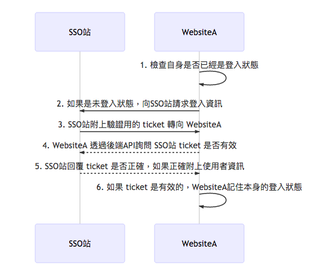

# PHP Single Sign-on Demo

這是一個用PHP寫的 Single Sign-on 範例 (因為 Single Sign-on 這個概念的實作可以有很多種，這邊只以一種為範本，可以依據自己需求做變形)。

## 啟動

這邊以docker做示範，需先安裝docker 並輸入指令啟動：

```
docker-compose up
```

## 網站

| 網址 | 說明 |
| --- | --- |
| http://localhost:9011 | SSO 站 |
| http://localhost:9012 | 子服務站 WebsiteA |
| http://localhost:9013 | 子服務站 WebsiteB |

Demo 帳號

| username | password |
| --- | --- |
| bob | 1234 |
| alice | 1234 |

## 運作流程

※ 以下流程中虛線表示在 backend 運作

### 從 SSO站 登入並到 WebsiteA：


<details>
  <summary>Mermaid source code</summary>

  ```
  sequenceDiagram
    participant SSO站
    participant WebsiteA
    SSO站->>SSO站: 1. 在SSO站登入，SSO站紀錄本身的登入狀態
    SSO站->>WebsiteA: 2. 點擊 Website 連結時，連結附上驗證用的 ticket 轉向 WebsiteA
    WebsiteA-->>SSO站: 3. WebsiteA 透過後端API詢問 SSO站 ticket 是否有效
    SSO站-->>WebsiteA: 4. SSO站回覆 ticket 是否正確，如果正確附上使用者資訊
    WebsiteA->>WebsiteA: 5. 如果 ticket 是有效的，WebsiteA記住本身的登入狀態
  ```
</details>

※ SSO站 發出的 ticket 可以混雜是發給哪個子站的資訊，並且要求 `詢問 SSO站 ticket` 時附上 `通關密碼` (只有該子站知道的code) 來確認 ticket 沒有被竊走

### SSO站已經是登入狀態，直接開啟WebsiteA的流程：



<details>
  <summary>Mermaid source code</summary>

  ```
  sequenceDiagram
    participant SSO站
    participant WebsiteA
    WebsiteA->>WebsiteA: 1. 檢查自身是否已經是登入狀態
    WebsiteA->>SSO站: 2. 如果是未登入狀態，向SSO站請求登入資訊
    SSO站->>WebsiteA: 3. SSO站附上驗證用的 ticket 轉向 WebsiteA
    WebsiteA-->>SSO站: 4. WebsiteA 透過後端API詢問 SSO站 ticket 是否有效
    SSO站-->>WebsiteA: 5. SSO站回覆 ticket 是否正確，如果正確附上使用者資訊
    WebsiteA->>WebsiteA: 6. 如果 ticket 是有效的，WebsiteA記住本身的登入狀態
  ```
</details>

※ SSO站 發出的 ticket 可以混雜是發給哪個子站的資訊，並且要求 `詢問 SSO站 ticket 是否有效` 時附上 `通關密碼` (只有該子站跟SSO站知道的code) 來確認 ticket 沒有被竊走

### 從 WebsiteA 進行登出的流程：


<details>
  <summary>Mermaid source code</summary>

  ```
  sequenceDiagram
    participant SSO站
    participant WebsiteA
    participant WebsiteB
    WebsiteA->>SSO站: 1. 發出登出請求
    SSO站->>WebsiteA: 2. SSO站向WebsiteA 要求登出
    WebsiteA->>WebsiteA: WebsiteA 執行登出
    SSO站->>WebsiteB: 3. SSO站向WebsiteB 要求登出
    WebsiteB->>WebsiteB: 4. WebsiteB 執行登出
    SSO站->>SSO站: 5. SSO站 執行登出
  ```
</details>

※ WebsiteB 是個範例(未實作)，可能會有多個子服務站

※ 避免有 WebsiteA 是身分A，而 WebsiteB 是身分B的情況發生，在登出時需由SSO站對所有子服務站進行要求登出

## 細節

ticket 是使用 `AES-256-CBC` 演算法進行加密的資料(加密密鑰只有SSO站知道)

ticket 內容包括：

- username : 用來辨識這個 ticket 是哪個使用者
- site_id : 用於辨識該 ticket 是簽發給哪個網站的，確認 `site_id` 與 `通關密碼` 符合時才能通過 (防止 ticket 被使用者從A站複製去B站使用)
- expired_at : 一個很快過期的時間 (例如：3秒)，可以避免使用者直接點瀏覽器歷史紀錄就直接登入了
